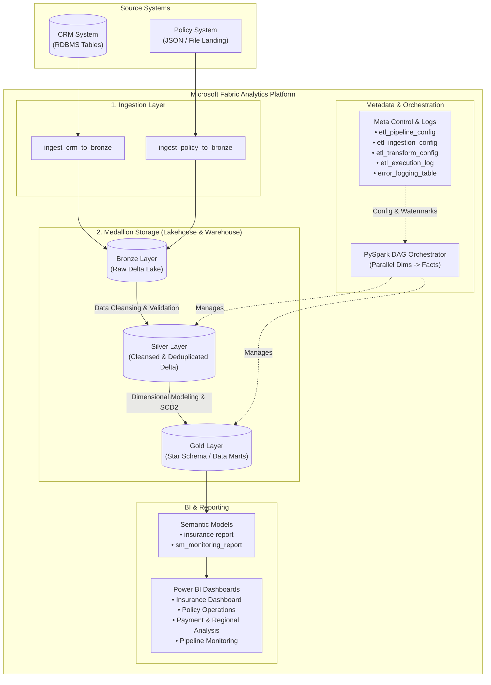
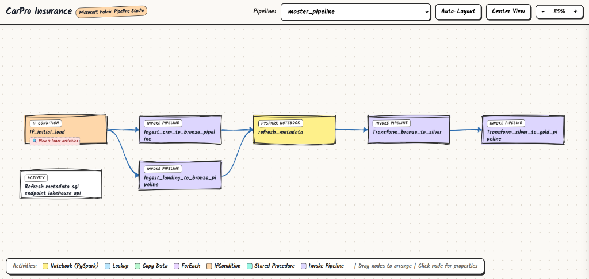
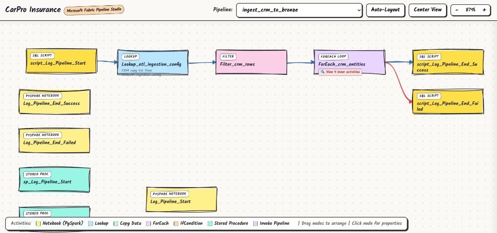
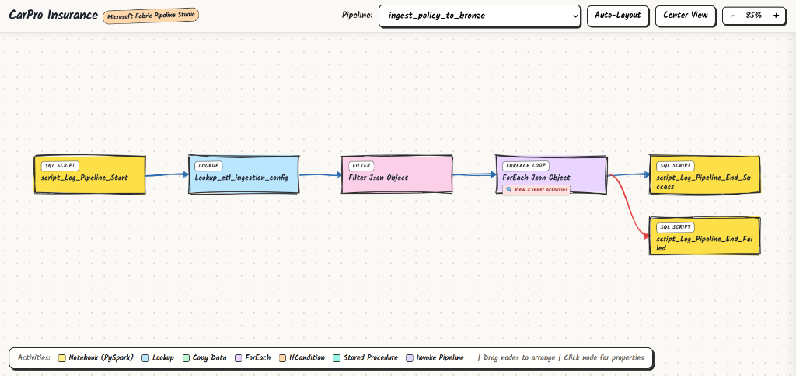
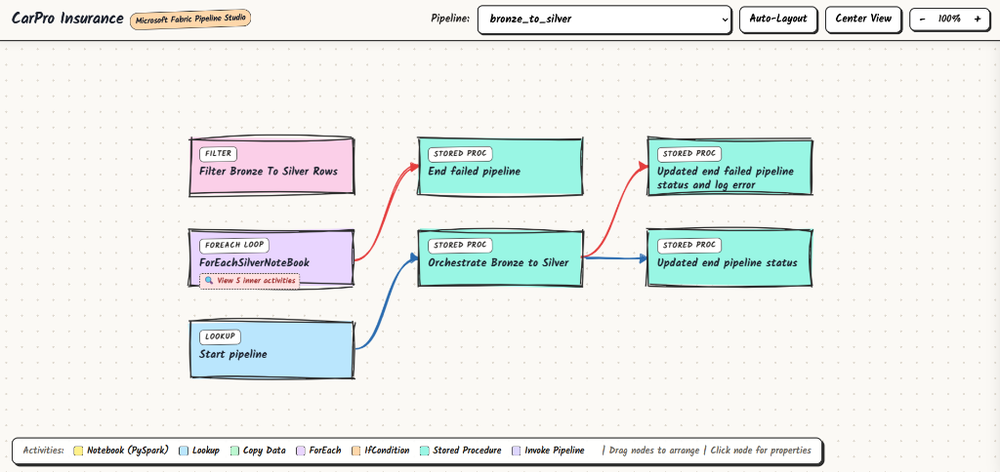
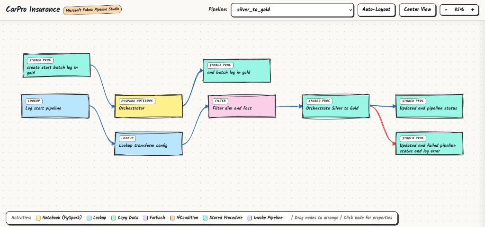

# CarPro Insurance - End-to-End Analytics Data Platform

> Modern Data Platform for Auto Insurance Analytics built on Microsoft Fabric & Medallion Architecture (Lakehouse + Data Warehouse).

---

## 1. Project Overview

CarPro Insurance Data Platform is an enterprise-grade, end-to-end data engineering platform designed for the automobile insurance industry. It ingests data from heterogeneous operational systems (CRM database and Policy management files), transforms and enriches data across Bronze, Silver, and Gold layers, and serves dimensional data marts for business intelligence and executive decision-making in Power BI.

### Key Highlights
* **Microsoft Fabric Unified Platform:** Integrates Fabric Data Pipelines, Synapse PySpark Notebooks, Delta Lake, Synapse Data Warehouse, and Power BI Direct Lake / Semantic Models.
* **Medallion Architecture:** Clean separation of concerns across Bronze (Raw Delta), Silver (Cleaned & Conformed), and Gold (Dimensional Star Schema).
* **Metadata-Driven ETL Framework:** Dynamic pipeline configuration, incremental watermarking, automated logging, and auditing stored in dedicated `meta.*` tables.
* **Dynamic DAG Orchestration:** PySpark-driven execution (`notebookutils.notebook.runMultiple`) orchestrating parallel dimension loads followed by fact dependencies.
* **Slowly Changing Dimensions (SCD Type 2):** Full historical tracking for customer profile changes using surrogate keys, effective/expiry dates, and active flags.
* **Automated Failure Recovery:** Built-in recovery pipelines and checkpointing to resume failed runs without full re-computations.
* **Interactive Local Visualizer:** Standalone Excalidraw-style interactive studio (`pipeline_visualizer.html`) for offline exploration of all pipeline workflows without active Fabric capacity.

---

## 2. Architecture & Data Flow



---

## 3. Pipeline Orchestration & Workflow Visuals

The data platform includes pre-configured Fabric Data Pipelines for end-to-end ingestion, schema initialization, metadata synchronization, and dimensional transformations.

### 3.1 Master Orchestration Pipeline (`master_pipeline`)
Controls conditional initial schema loading, parallel ingestion from CRM and landing files into Bronze, SQL Endpoint metadata refresh, followed by Silver and Gold transformations.



---

### 3.2 CRM Ingestion Pipeline (`ingest_crm_to_bronze`)
Logs execution start, queries dynamic ingestion parameters from `meta.etl_ingestion_config`, filters CRM tables, and executes batched data copying into Bronze Delta tables with full audit logging.



---

### 3.3 Policy Ingestion Pipeline (`ingest_policy_to_bronze`)
Extracts raw policy JSON files from the landing directory into Bronze Delta tables with automated high-watermark tracking and error handling.



---

### 3.4 Bronze to Silver Transformation (`bronze_to_silver`)
Performs schema validation, data deduplication, row-level hashing, and business cleansing across customer, vehicle, quotation, and policy datasets.



---

### 3.5 Silver to Gold Transformation (`silver_to_gold`)
Initializes the batch log, triggers the PySpark Orchestrator to execute parallel dimension notebooks, and populates fact tables via stored procedures.



---

## 4. Repository Structure

```text
carproinsurance-data-platform/
├── pipeline_visualizer.html        # Interactive Excalidraw-style offline studio
├── data pipelines/                 # Microsoft Fabric Data Pipeline Definitions
│   ├── master_pipeline.DataPipeline             # Master orchestration pipeline
│   ├── ingest_crm_to_bronze.DataPipeline        # CRM ingestion to Bronze
│   ├── ingest_policy_to_bronze.DataPipeline     # Policy JSON ingestion to Bronze
│   ├── bronze_to_silver.DataPipeline            # Bronze to Silver pipeline
│   ├── silver_to_gold.DataPipeline              # Silver to Gold pipeline
│   ├── migrate_data_pipeline.DataPipeline       # Data migration pipelines
│   └── recover_*.DataPipeline                   # Dedicated recovery & retry pipelines
│
├── notebooks/                      # PySpark & Spark SQL Transformation Notebooks
│   ├── bronze/                        # Bronze watermarking & helper notebooks
│   │   └── nb_compute_watermark.Notebook
│   ├── silver/                        # Silver transformation & cleansing logic
│   │   ├── crm_customer.Notebook      # Dedup, cleansing, row hash
│   │   ├── crm_agent.Notebook
│   │   ├── crm_vehicle.Notebook
│   │   ├── crm_quotation.Notebook
│   │   ├── crm_quotation_item.Notebook
│   │   ├── crm_insurance_provider.Notebook
│   │   ├── policy_policy.Notebook
│   │   ├── policy_payment.Notebook
│   │   └── policy_cancellation.Notebook
│   ├── gold/                          # Gold Star Schema generation (Dims & Facts)
│   │   ├── nb_dim_customer.Notebook   # SCD Type 2 implementation
│   │   ├── nb_dim_agent.Notebook
│   │   ├── nb_dim_vehicle.Notebook
│   │   ├── nb_dim_date.Notebook
│   │   ├── nb_dim_*.Notebook          # Lookup seeds & status dimensions
│   │   ├── nb_fact_quotation.Notebook
│   │   ├── nb_fact_quotation_item.Notebook
│   │   ├── nb_fact_policy.Notebook
│   │   ├── nb_fact_payment.Notebook
│   │   └── nb_fact_cancellation.Notebook
│   ├── logging/                       # Audit logging utilities
│   ├── ddl/                           # Meta schema & lakehouse DDL definitions
│   ├── orchestrator.Notebook          # Dynamic DAG scheduler
│   └── recovery_orchestrator.Notebook # Failure recovery scheduler
│
├── Storage/                        # Lakehouse & Warehouse Schema & Stored Procedures
│   ├── insurance_lakehouse.Lakehouse
│   └── insurance_warehouse.Warehouse  # T-SQL DDLs & Stored Procedures (sp_*, usp_*)
│
├── reports/                        # Power BI Semantic Models & Reports
│   ├── Insurance_Dashboard.Report
│   ├── PolicyOperations.Report
│   ├── Payment_Regional_Dashboard.Report
│   ├── Monitoring Report.Report
│   └── insurance report.SemanticModel
│
└── docs/images/                    # Pipeline architecture and workflow screenshots
```

---

## 5. Data Layers & Medallion Details

### Bronze Layer (Raw Ingestion)
* Ingests source data from CRM (RDBMS) and Policy (JSON files) into raw Delta tables.
* Maintains raw data fidelity with minimal schema enforcement.
* Supports incremental loading using high-watermark columns (`updated_at`, `created_at`).

### Silver Layer (Cleansed & Conformed)
* Applies data quality rules, data type conversions, and null handling.
* Business Key deduplication using Spark SQL window functions.
* Generates `row_hash` for Change Data Capture (CDC).
* Validates relationships between quotations, vehicles, customers, and policies.

### Gold Layer (Star Schema Data Mart)

#### Dimension Tables:
| Table Name | Type | Description |
| :--- | :--- | :--- |
| `dim_customer` | SCD Type 2 | Full history tracking of customer demographics, contacts, and addresses |
| `dim_agent` | SCD Type 1 | Agent profile, branch, and commission tiers |
| `dim_vehicle` | SCD Type 1 | Vehicle specifications, make, model, year, and registration details |
| `dim_insurance_provider` | SCD Type 1 | Partner insurance company information |
| `dim_date` | Conformed | Calendar dimension with fiscal, quarterly, and weekly rollups |
| `dim_policy_status` / `dim_payment_status` / `dim_payment_method` | Lookup | Standardized lookup code seeds |

#### Fact Tables:
| Table Name | Granularity | Key Metrics |
| :--- | :--- | :--- |
| `fact_quotation` | One row per quotation header | Quotation amount, discount, conversion flag |
| `fact_quotation_item` | One row per quoted coverage item | Item premium, deductible, coverage limit |
| `fact_policy` | One row per issued policy | Total premium, insured value, term length |
| `fact_payment` | One row per payment transaction | Amount paid, late fees, transaction status |
| `fact_cancellation` | One row per policy cancellation | Refund amount, cancellation fee, days active |

---

## 6. Metadata-Driven Governance

The ETL process is controlled via the `meta` schema:

1. **`meta.etl_pipeline_config`**: Registry of active pipelines, timeouts, and retry policies.
2. **`meta.etl_ingestion_config`**: Configuration for source-to-bronze ingestion, watermark fields, and load types.
3. **`meta.etl_transform_config`**: Transformation rules, target tables, PK definitions, and SCD strategies.
4. **`meta.etl_execution_log`**: Comprehensive execution history tracking records read/inserted, watermark boundaries, and status.
5. **`meta.error_logging_table`**: Centralized error capture with stack traces and failing step IDs.

---

## 7. Execution & Deployment Guide

### Prerequisites
* Microsoft Fabric workspace with Fabric capacity.
* Fabric Lakehouse: `insurance_lakehouse`.
* Fabric Warehouse: `insurance_warehouse`.

### Initialization Steps
1. **Initialize Schemas:**
   * Run [ddl_meta_schema.Notebook](file:///notebooks/ddl/ddl_meta_schema.Notebook) to create and seed the `meta` tables.
   * Run [ddl_lakehouse_tables.Notebook](file:///notebooks/ddl/ddl_lakehouse_tables.Notebook) to establish Lakehouse Delta tables.
2. **Run Master Pipeline:**
   * Trigger `data pipelines/master_pipeline.DataPipeline` with parameters:
     * `initial_load`: `true` (for the first run) or `false` (for incremental runs).
3. **Monitor & Recover:**
   * Review execution logs in `meta.etl_execution_log` or via the Monitoring Report dashboard.
   * In case of failures, execute `recovery_master_pipeline` to recover without data loss or duplicate records.

---

## 8. Reports & Analytics

* **Insurance Executive Dashboard:** High-level KPIs (Total GWP, Active Policies, Loss Ratio, Renewal Rates).
* **Policy Operations Report:** Underwriting turnaround time, quotation-to-policy conversion funnel, agent performance.
* **Payment & Regional Dashboard:** Regional collection efficiency, payment method distribution, outstanding receivables.
* **ETL Monitoring Dashboard:** Pipeline health, latency, row counts, and data quality metrics.
